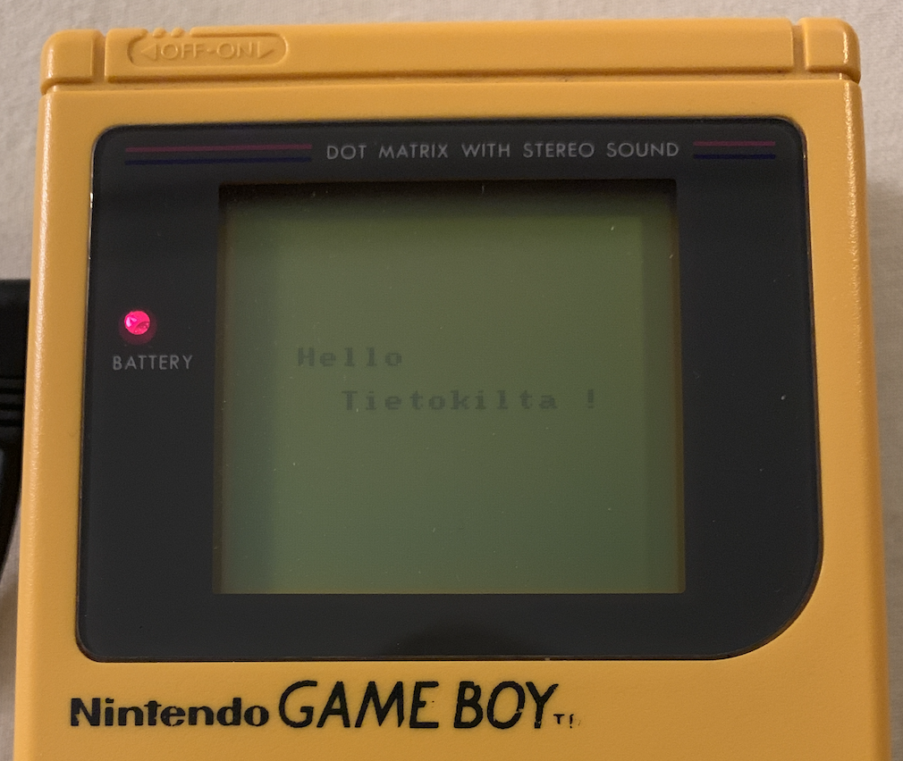

title: "GBForth"
controls: false
progress: true
numbers: true
theme: tkers/cleaver-theme-sunset

--

# GBForth

## Using Forth to understand the Game Boy


--

### 🍒 Who am I?

- **Tijn Kersjes**
- Software consultant at Reaktor
- (writing a lot of JavaScript)
- After-hours hacking

--

### 👨‍💻 Amsterdam Hackers

A group of people in Amsterdam who gather together to appease our curiosity, **learn and have fun** by engaging in **challenging** and interesting projects.

> A lot of people underestimate their abilities. The best way to learn is not to be afraid to try to solve problems you do not know how to solve yet.


--

### 👨‍💻 Amsterdam Hackers

- Write an emulator?
- ...a Game Boy game?
- ...a **compiler**!

<!--  -->


--

# Initial research


--

### Game Boy hardware

- 8-bit CPU
- 4 MHz (~1MHz CPU clock)
- 32kB ROM, 4kB RAM
- 8 + 2 registers:
  

--

## 

--

#### Special registers (`$FF00` - `$FFFF`)

- Video subsystem (palette, tiles, scroll, background)
- Sound subsystem (square1, square2, wave, noise)
- Input buttons
- Timers

--

### How do we start?

- Keep reading the manual
- Start writing a compiler (somehow)
- ...wait forever until you get something on the screen

#### However...

- Not incremental
- Long feedback cycle

--

# Instead ✨

- Start with working game (example)
- Reverse-engineer binary
- Try to refactor bytes
  - Add abstractions
  - Build libraries
- Write a compiler on top

--

### Forth

- No syntax, just **words**
- Using stack for arguments

```
5 1 + .
```

- `5` push to stack
- `1` push to stack
- `+` pop 2 arguments and push sum
- `.` pop 1 argument and print

--

### Forth

You can create new words

```
5 1 + .
```

can be refactored into:

<pre>
<b style="color: #ffffff">: INC</b>
  1 + <b style="color: #ffffff">;</b>

5 INC .
</pre>

--

### Forth

- Simplest imaginable language
- Concatenative
  - _concatenation is composition_
- Grow your own language

--

# Starting the project

--


--

### Machine code (ROM)

```
$00  $c3  $50  $01  $ce  $ed  $66  $66
$cc  $0d  $00  $0b  $03  $73  $00  $83
$00  $0c  $00  $0d  $00  $08  $11  $1f
$88  $89  $00  $0e  $dc  $cc  $6e  $e6
$dd  $dd  $d9  $99  $bb  $bb  $67  $63
$6e  $0e  $ec  $cc  $dd  $dc  $99  $9f
$bb  $b9  $33  $3e  $45  $58  $41  $4d
$50  $4c  $45  $00  $00  $00  $00  $00
$00  $00  $00  $00  $00  $00  $00  $00
$00  $00  $01  $33
```

--

### Forth program that emits bytes

<pre>
$00 <span style="color: #61aeee">c,</span> $c3 <span style="color: #61aeee">c,</span> $50 <span style="color: #61aeee">c,</span> $01 <span style="color: #61aeee">c,</span> $ce <span style="color: #61aeee">c,</span> $ed <span style="color: #61aeee">c,</span> $66 <span style="color: #61aeee">c,</span> $66 <span style="color: #61aeee">c,</span>
$cc <span style="color: #61aeee">c,</span> $0d <span style="color: #61aeee">c,</span> $00 <span style="color: #61aeee">c,</span> $0b <span style="color: #61aeee">c,</span> $03 <span style="color: #61aeee">c,</span> $73 <span style="color: #61aeee">c,</span> $00 <span style="color: #61aeee">c,</span> $83 <span style="color: #61aeee">c,</span>
$00 <span style="color: #61aeee">c,</span> $0c <span style="color: #61aeee">c,</span> $00 <span style="color: #61aeee">c,</span> $0d <span style="color: #61aeee">c,</span> $00 <span style="color: #61aeee">c,</span> $08 <span style="color: #61aeee">c,</span> $11 <span style="color: #61aeee">c,</span> $1f <span style="color: #61aeee">c,</span>
$88 <span style="color: #61aeee">c,</span> $89 <span style="color: #61aeee">c,</span> $00 <span style="color: #61aeee">c,</span> $0e <span style="color: #61aeee">c,</span> $dc <span style="color: #61aeee">c,</span> $cc <span style="color: #61aeee">c,</span> $6e <span style="color: #61aeee">c,</span> $e6 <span style="color: #61aeee">c,</span>
$dd <span style="color: #61aeee">c,</span> $dd <span style="color: #61aeee">c,</span> $d9 <span style="color: #61aeee">c,</span> $99 <span style="color: #61aeee">c,</span> $bb <span style="color: #61aeee">c,</span> $bb <span style="color: #61aeee">c,</span> $67 <span style="color: #61aeee">c,</span> $63 <span style="color: #61aeee">c,</span>
$6e <span style="color: #61aeee">c,</span> $0e <span style="color: #61aeee">c,</span> $ec <span style="color: #61aeee">c,</span> $cc <span style="color: #61aeee">c,</span> $dd <span style="color: #61aeee">c,</span> $dc <span style="color: #61aeee">c,</span> $99 <span style="color: #61aeee">c,</span> $9f <span style="color: #61aeee">c,</span>
$bb <span style="color: #61aeee">c,</span> $b9 <span style="color: #61aeee">c,</span> $33 <span style="color: #61aeee">c,</span> $3e <span style="color: #61aeee">c,</span> $45 <span style="color: #61aeee">c,</span> $58 <span style="color: #61aeee">c,</span> $41 <span style="color: #61aeee">c,</span> $4d <span style="color: #61aeee">c,</span>
$50 <span style="color: #61aeee">c,</span> $4c <span style="color: #61aeee">c,</span> $45 <span style="color: #61aeee">c,</span> $00 <span style="color: #61aeee">c,</span> $00 <span style="color: #61aeee">c,</span> $00 <span style="color: #61aeee">c,</span> $00 <span style="color: #61aeee">c,</span> $00 <span style="color: #61aeee">c,</span>
$00 <span style="color: #61aeee">c,</span> $00 <span style="color: #61aeee">c,</span> $00 <span style="color: #61aeee">c,</span> $00 <span style="color: #61aeee">c,</span> $00 <span style="color: #61aeee">c,</span> $00 <span style="color: #61aeee">c,</span> $00 <span style="color: #61aeee">c,</span> $00 <span style="color: #61aeee">c,</span>
$00 <span style="color: #61aeee">c,</span> $00 <span style="color: #61aeee">c,</span> $01 <span style="color: #61aeee">c,</span> $33 <span style="color: #61aeee">c,</span>
</pre>

--

### Find the patterns and meaning

<pre>
$00 c, $c3 c, $50 c, $01 c, <span style="color: #61aeee">$ce c, $ed c, $66 c, $66 c,
$cc c, $0d c, $00 c, $0b c, $03 c, $73 c, $00 c, $83 c,
$00 c, $0c c, $00 c, $0d c, $00 c, $08 c, $11 c, $1f c,
$88 c, $89 c, $00 c, $0e c, $dc c, $cc c, $6e c, $e6 c,
$dd c, $dd c, $d9 c, $99 c, $bb c, $bb c, $67 c, $63 c,
$6e c, $0e c, $ec c, $cc c, $dd c, $dc c, $99 c, $9f c,
$bb c, $b9 c, $33 c, $3e c,</span> <span style="color: #e6c07b">$45 c, $58 c, $41 c, $4d c,
$50 c, $4c c, $45 c, $00 c, $00 c, $00 c, $00 c, $00 c,
$00 c, $00 c, $00 c, $00 c, $00 c, $00 c, $00 c, $00 c,</span>
$00 c, $00 c, $01 c, $33 c,
</pre>

--

### Extract data into definitions

<pre>
<span style="color: #61aeee"><b>: logo</b>
  $ce c, $ed c, $66 c, $66 c, $cc c, $0d c, $00 c, $0b c,
  $03 c, $73 c, $00 c, $83 c, $00 c, $0c c, $00 c, $0d c,
  $00 c, $08 c, $11 c, $1f c, $88 c, $89 c, $00 c, $0e c,
  $dc c, $cc c, $6e c, $e6 c, $dd c, $dd c, $d9 c, $99 c,
  $bb c, $bb c, $67 c, $63 c, $6e c, $0e c, $ec c, $cc c,
  $dd c, $dc c, $99 c, $9f c, $bb c, $b9 c, $33 c, $3e c, <b>;</b></span>

<span style="color: #e6c07b"><b>: title</b>
  $45 c, $58 c, $41 c, $4d c, $50 c, $4c c, $45 c, $00 c,
  $00 c, $00 c, $00 c, $00 c, $00 c, $00 c, $00 c, $00 c, <b>;</b></span>

$00 c, $c3 c, $50 c, $01 c,
<span style="color: #61aeee">logo</span>
<span style="color: #e6c07b">title</span>
$00 c, $00 c, $01 c, $33 c,

</pre>

--

### Decompiling machine code

- `$3c` is machine code for `INC A`
- `$04` is machine code for `INC B`

#### Create more words!

<pre>
<b style="color: #ffffff">: INC-A,</b> $3c c, <b style="color: #ffffff">;</b>
<b style="color: #ffffff">: INC-B,</B> $04 c, <b style="color: #ffffff">;</b>
</pre>

--

### Decompiling machine code

- `$3c` is machine code for `INC A`
- `$04` is machine code for `INC B`

#### Discover a pattern?

<pre>
: INC-A, %00<b style="color: #ffffff">111</b>100 c, ;
: INC-B,</B> %00<b style="color: #ffffff">000</b>100 c, ;
</pre>

--

### Decompiling machine code

- `$3c` is machine code for `INC A`
- `$04` is machine code for `INC B`

#### Factor out operands to create full assembler

<pre>
<b style="color: #ffffff">: A</b> %00111000 <b style="color: #ffffff">;</b>
<b style="color: #ffffff">: B</b> %00000000 <b style="color: #ffffff">;</b>

<b style="color: #ffffff">: INC,</b>
  %00000100 or c, <b style="color: #ffffff">;</b>
</pre>

- `A INC,` emits `$3c`

--

### Complete assembler

- Extend language with pattern matching
  - Define `~~>` and `::`


--

### Translate ROM to assembler

<pre>
di,
$ffff # sp ld,

%11100100 # a ld,
a [rGBP] ld,

0 # a ld,
a [rSCX] ld,
a [rSCY] ld,

<span style="color: #99bb99">( ... )</span>
</pre>

--

### Macros for free!

<pre>
<span style="color: #61aeee"><b>: reset-scroll</b>
  0 # a ld,
  a [rSCX] ld,
  a [rSCY] ld, <b>;</b></span>

di,
$ffff # sp ld,

%11100100 # a ld,
a [rGBP] ld,

<span style="color: #61aeee">reset-scroll</span>

<span style="color: #99bb99">( ... )</span>
</pre>

--

### Macros for free!

<pre>
<span style="color: #61aeee"><b>: reset-scroll</b>
  0 # a ld,
  a [rSCX] ld,
  a [rSCY] ld, <b>;</b></span>

<span style="color: #e6c07b"><b>: reset-palette</b>
  %11100100 # a ld,
  a [rGBP] ld, <b>;</b></span>

di,
$ffff # sp ld,

<span style="color: #e6c07b">reset-palette</span>

<span style="color: #61aeee">reset-scroll</span>

<span style="color: #99bb99">( ... )</span>
</pre>

--

### Now what? 🤔


--



--

# Next steps

## Implementing Forth

--

### Implementing Forth

#### The easy way:

- Use ASM macros to define Forth primitives
  - `dup`, `swap`, `+`...

#### The hard way:

- Create Intermediate Representation for definitions
  - Lazy emitting
  - Optimisations

--

### Eventually...

- Implement code primitives (ASM)
- Adding high level libraries (Forth)
- Translating ROM to Forth

--


--

### Limitations 💩

- No **run-time** on Game Boy (keyboard?)
- Division between **ROM** and **RAM**
- Limited space / banking

--

# The final test 💪

## Compiling a third party Forth game...

## &nbsp;

```fs
\ sokoban - a maze game in FORTH

\ Copyright (C) 1995,1997,1998,2003,2007,2012,2013,2015
\ Free Software Foundation, Inc.

\ This file is part of Gforth.

40 Constant /maze  \ maximal maze line

Create maze  1 cells allot /maze 25 * allot  \ current maze
Variable mazes   0 mazes !  \ root pointer
Variable soko    0 soko !   \ player position
Variable >maze   0 >maze !  \ current compiled maze

: maze-field ( -- addr n )
    maze dup cell+ swap @ chars ;

: .score ( -- )
    ." Level: " level# @ 2 .r ."  Score: " score @ 4 .r
    ."  Moves: " moves @ 6 .r ."  Rocks: " rocks @ 2 .r ;

: .maze ( -- )  \ display maze
    0 0 at-xy  .score
    cr  maze-field over + swap
    DO  I /maze type cr  /maze chars  +LOOP ;
```

--


--

### Future ideas 🚀

- ASM bug fixes
- Compiler optimisations: peephole, inlining
- GB Color support
- Memory Bank Controllers
- Automatic ROM bank switching
- Debugging tools
- Tutorial: Write a game in Forth

**Contributions welcome!**

-- dark

# Thank you!

- **[ams-hackers/gbforth](https://ams-hackers.github.io/gbforth)**
- [The Ultimate Game Boy Talk (33c3)](https://www.youtube.com/watch?v=HyzD8pNlpwI)
- [Reverse Engineering fine details of Game Boy hardware](https://www.youtube.com/watch?v=GBYwjch6oEE)


